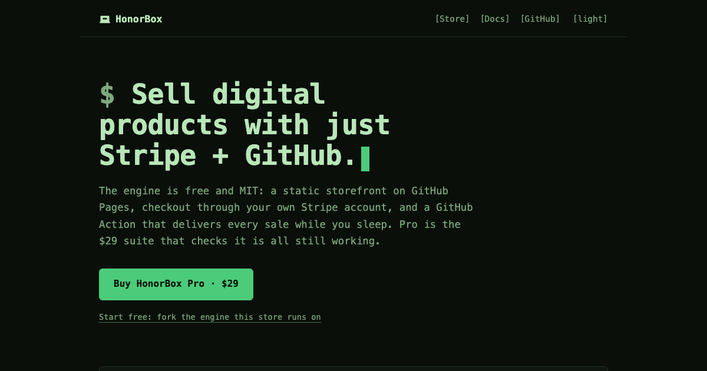
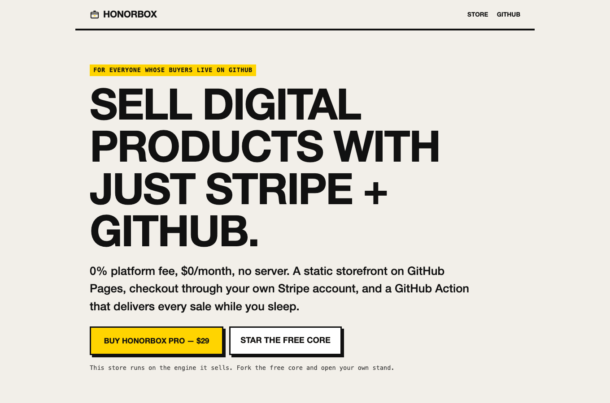
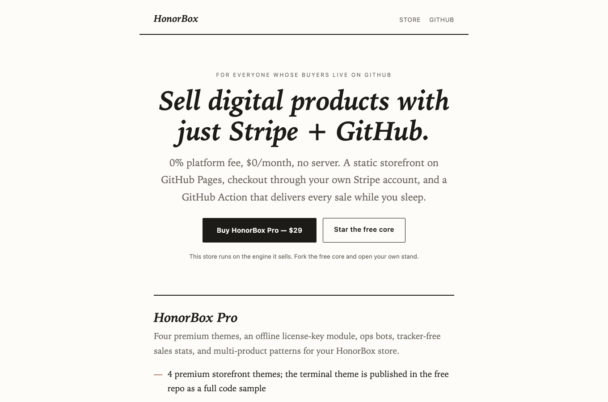
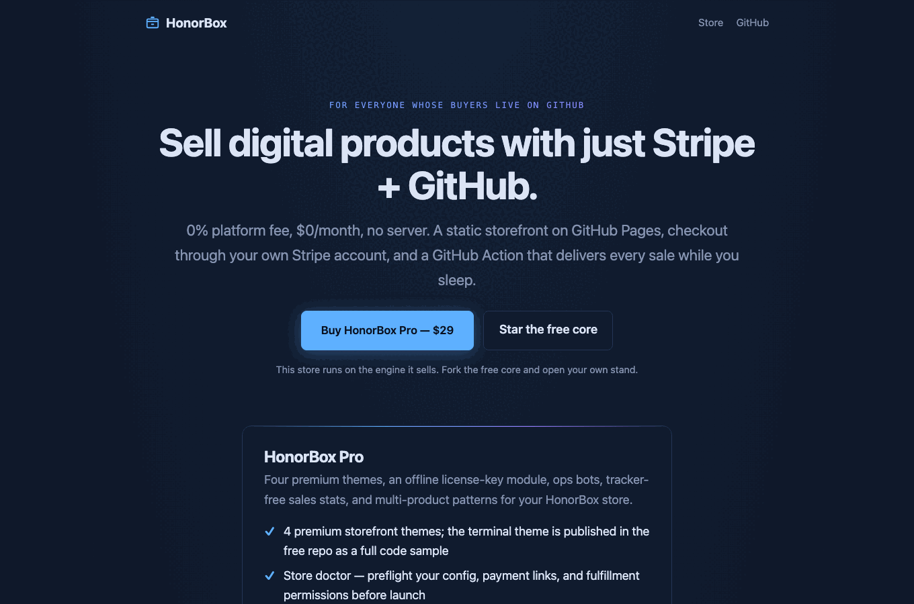

<p align="center"></p>

**Sell digital products with just Stripe + GitHub. No platform, no monthly fee, no server.**

HonorBox turns a GitHub repo into an unattended store — a roadside honor box for
the internet:

- **Storefront** — a fast static site, built by a zero-dependency Node script,
  hosted free on GitHub Pages.
- **Checkout** — Stripe Payment Links on *your own* Stripe account. Buyers pay
  you directly. No middleman fee, ever.
- **Fulfillment** — a scheduled GitHub Action polls Stripe, invites each buyer's
  GitHub account to your private product repo, and keeps your books. No
  webhooks, no database, no server to babysit.

**Live demo: [the HonorBox store](https://honorboxx.github.io/honorbox/)** — this
repo *is* a working store selling
[HonorBox Pro](https://honorboxx.github.io/honorbox/honorbox-pro.html). The
checkout you see there is the engine in this repo, unmodified.

## Why

| | Gumroad | Lemon Squeezy | HonorBox |
|---|---|---|---|
| Platform fee | 10% + 30¢ | 5% + 50¢ | **0%** |
| Monthly cost | $0 | $0 | **$0** |
| Your own Stripe account | no | no | **yes** |
| Server to maintain | — | — | **none** |
| Handles VAT for you | yes | yes | no — you're the merchant¹ |

¹ HonorBox is not a merchant of record. Fine for most small self-serve sellers;
[docs/tax.md](docs/tax.md) explains the tradeoff honestly instead of hiding it.

## How it works

```
buyer ──▶ storefront (GitHub Pages, static)
              │  "Buy" = a Stripe Payment Link (custom field: GitHub username)
              ▼
        Stripe Checkout ──▶ money lands in YOUR Stripe balance
              ▲
              │ polled every 15 min (no webhooks, no server)
        GitHub Action ──▶ invites buyer to your private product repo
                     ──▶ appends your (private) sales ledger
```

The fulfillment engine is ~170 lines of dependency-free Node. Read it in ten
minutes: [`scripts/fulfill.js`](scripts/fulfill.js).

## Quickstart

1. **Use this template**, edit `store.config.json` (name, copy, your URLs).
2. **One command creates your product on Stripe** — Product, Price, and a
   Payment Link with the delivery field, wired straight into your config:

   ```bash
   STRIPE_SECRET_KEY=sk_... node scripts/init.js \
     --name "My Tool" --price 2900 --repo you/my-tool-access
   ```

   (Prefer clicking? The manual dashboard steps are in [docs/setup.md](docs/setup.md).)
3. **Pages**: copy `setup/workflows/deploy.yml` into `.github/workflows/`, enable
   GitHub Pages (Actions source), push — the store deploys.
4. **Fulfillment**: create a *private* ops repo, copy
   [`setup/workflows/fulfill.yml.example`](setup/workflows/fulfill.yml.example)
   plus `scripts/`, add `STRIPE_SECRET_KEY` (restricted key recommended) and a
   `GH_FULFILL_TOKEN` PAT as secrets.
5. Sell things.

Full walkthrough: [docs/setup.md](docs/setup.md) ·
Architecture and threat model: [docs/how-it-works.md](docs/how-it-works.md)

## Optional: a public ledger

The fulfillment engine keeps an anonymized sales ledger (date, product, amount,
country, hash — never names or emails) in your private ops repo. If you *want*
radical transparency, drop that `ledger/ledger.json` into your storefront repo
and the builder adds a public `/trust` page for it. Off by default.

## The themes

The free core ships `stand` (warm paper). Pro adds four more — every one a
complete, hand-tuned design, switchable with one config line:

| | |
|---|---|
|  |  |
|  |  |

## Free core vs Pro

The free core is a **complete store** — one theme, checkout, fulfillment,
docs. [HonorBox Pro ($29, one-time)](https://honorboxx.github.io/honorbox/honorbox-pro.html)
adds four premium themes, multi-product catalog patterns, an offline ed25519
license-key module, and a commerce playbook — and buying it funds the free core.

## Development

```
node --test scripts/test/core.test.js   # unit tests
node scripts/build.js                   # build storefront -> dist/
```

No dependencies. Node ≥ 20.

## Support

honorbox@proton.me · [issues](https://github.com/Honorboxx/honorbox/issues)

## License

MIT for everything in this repo. Pro content is licensed separately.
