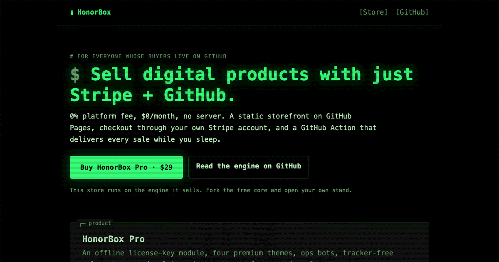
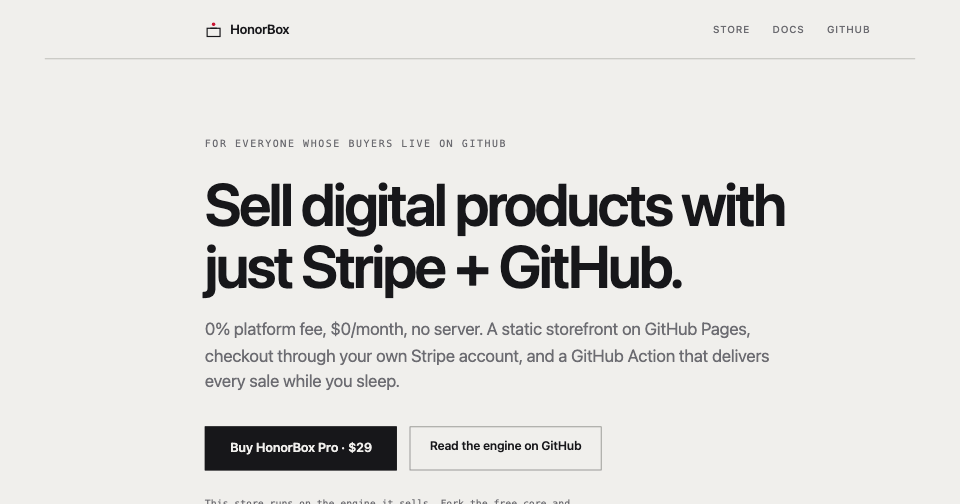
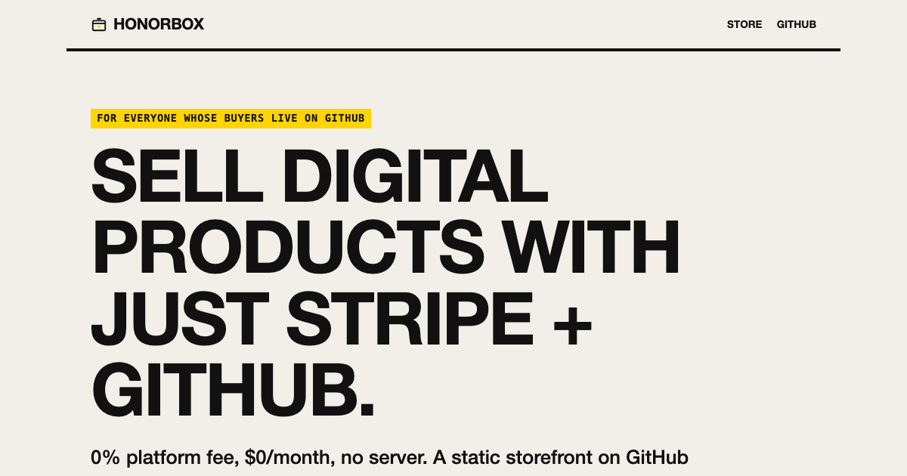
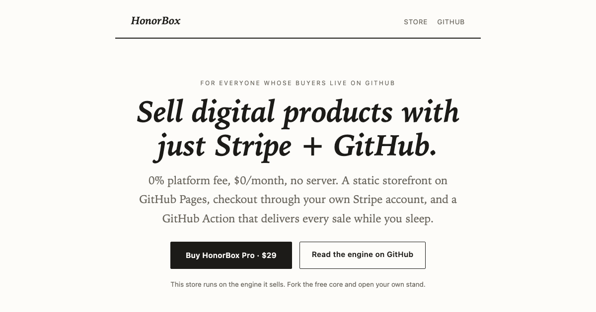
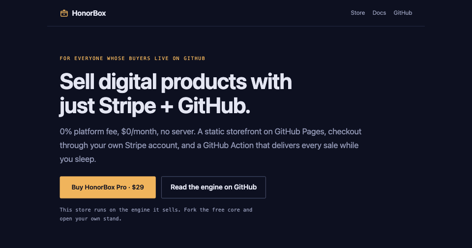

<p align="center"></p>

**Sell digital products with just Stripe + GitHub. No platform, no monthly fee, no server.**

HonorBox turns a GitHub repo into an unattended store, a roadside honor box
for the internet:

- **Storefront:** a fast static site, built by a zero-dependency Node script,
  hosted free on GitHub Pages.
- **Checkout:** Stripe Payment Links on *your own* Stripe account. Buyers pay
  you directly. No middleman fee, ever.
- **Fulfillment:** a scheduled GitHub Action polls Stripe, invites each buyer's
  GitHub account to your private product repo, and keeps your books. GitHub
  expires an unaccepted invitation after seven days, so it re-issues before that
  happens: a buyer who missed the email does not quietly lose what they paid
  for. No webhooks required, no database, no server to babysit (opt-in webhook
  mode available when you want near-instant delivery).

**Live demo: [the HonorBox store](https://honorboxx.github.io/honorbox/).** This
repo *is* a working store selling
[HonorBox Pro](https://honorboxx.github.io/honorbox/honorbox-pro.html). The
checkout you see there is the engine in this repo, unmodified.

## Why

| | Gumroad | Lemon Squeezy | HonorBox |
|---|---|---|---|
| Platform fee | 10% + 50¢ ² | 5% + 50¢ | **0%** |
| Monthly cost | $0 | $0 | **$0** |
| Your own Stripe account | no | no | **yes** |
| Server to maintain | n/a | n/a | **none** |
| Handles VAT for you | yes | yes | no; you're the merchant ¹ |

¹ HonorBox is not a merchant of record. Fine for most small self-serve sellers;
[docs/tax.md](docs/tax.md) spells out the trade-off.
² Plus card processing (2.9% + 30¢), charged on top per
[Gumroad's fee page](https://gumroad.com/help/article/66-gumroads-fees).
Lemon Squeezy's fee includes processing; with HonorBox you pay Stripe's
standard rate and nothing else. Fees as published July 2026.

## How it works

```
buyer ──▶ storefront (GitHub Pages, static)
              │  "Buy" = a Stripe Payment Link (custom field: GitHub username)
              ▼
        Stripe Checkout ──▶ money lands in YOUR Stripe balance
              ▲
              │ polled on a schedule (no webhooks/server; opt-in webhook mode = instant)
        GitHub Action ──▶ invites buyer to your private product repo
                     ──▶ appends your (private) sales ledger
```

The fulfillment engine is under 300 lines of dependency-free Node on a pure
logic core of similar size (which is why it can be unit-tested without a
network). Read both in ten minutes: [`scripts/fulfill.js`](scripts/fulfill.js)
and [`scripts/lib/fulfill-core.js`](scripts/lib/fulfill-core.js).

## Quickstart

1. **Use this template**, edit `store.config.json`: name, copy, your URLs, and
   `repo` (your own `owner/name`). Then delete `products/honorbox-pro.md` and
   `products/crew.md` and write your own: they carry HonorBox's real checkout
   links, and a store that keeps them sells *our* product into *our* Stripe
   account. The build stops you and names every leftover, but it is faster to
   just delete them now.
2. **One command creates your product on Stripe**: Product, Price, and a
   Payment Link with the delivery field, wired straight into your config:

   ```bash
   STRIPE_SECRET_KEY=rk_... node scripts/init.js \
     --name "My Tool" --price 2900 --repo you/my-tool-access
   ```

   (`rk_` = a temporary restricted key; scopes in
   [docs/least-privilege.md](docs/least-privilege.md). Prefer clicking? The
   manual dashboard steps are in [docs/setup.md](docs/setup.md).)
3. **Pages**: copy `setup/workflows/deploy.yml` into `.github/workflows/`, enable
   GitHub Pages (Actions source), push. The store deploys.
4. **Fulfillment**: create a *private* ops repo. Copy in `scripts/` and your
   `store.config.json` (the engine reads its grants from it), and
   [`setup/workflows/fulfill.yml.example`](setup/workflows/fulfill.yml.example)
   renamed to `.github/workflows/fulfill.yml`. Add `STRIPE_SECRET_KEY`
   (restricted key recommended) and a `GH_FULFILL_TOKEN` PAT as secrets.
5. Sell things.

Full walkthrough: [docs/setup.md](docs/setup.md) ·
Architecture and threat model: [docs/how-it-works.md](docs/how-it-works.md)

> **Scared of "secret key in a GitHub Action"? Good instinct.** HonorBox needs
> neither your full Stripe key nor a broad GitHub token: a restricted Stripe key
> with one read-only permission and a fine-grained PAT scoped to the product
> repo alone run the whole engine. Exact toggles, what breaks if you over-cut,
> and what a leaked key could and couldn't do:
> [docs/least-privilege.md](docs/least-privilege.md).

## Optional: a public ledger

The fulfillment engine keeps an anonymized sales ledger (date, product, amount,
country, hash; never names or emails) in your private ops repo. If you *want*
radical transparency, drop that `ledger/ledger.json` into your storefront repo
and the builder adds a public `/trust` page for it. Off by default.

## The themes

The free core ships `stand` (warm paper) **and `terminal`** (phosphor CRT).
The latter is a full Pro theme published here as an auditable sample of the
paid pack's code quality. Pro adds four more, each a complete hand-tuned
design, switchable with one config line:

| | |
|---|---|
|  |  |
|  |  |
|  | |

## Free core vs Pro

The free core is a **complete store**: two themes, checkout, fulfillment,
docs. [HonorBox Pro ($29, one-time)](https://honorboxx.github.io/honorbox/honorbox-pro.html)
adds an offline ed25519 license-key module, five premium themes, multi-product
catalog patterns, and a commerce playbook. Buying it funds the free core.

## Stability promise

`store.config.json`, the product frontmatter, and the fulfillment grant format
are **stable**: breaking changes only in a major version, always with an
UPGRADING note and a migration path. Fast iteration happens behind the config;
the format holds still.

## Development

```
npm test                                # the whole suite (what CI runs)
node --test scripts/test/core.test.js   # one file, while iterating
node scripts/build.js                   # build storefront -> dist/
```

No dependencies. Node ≥ 20.

## Support

honorbox@proton.me · [issues](https://github.com/Honorboxx/honorbox/issues)

## License

MIT for everything in this repo. Pro content is licensed separately.
