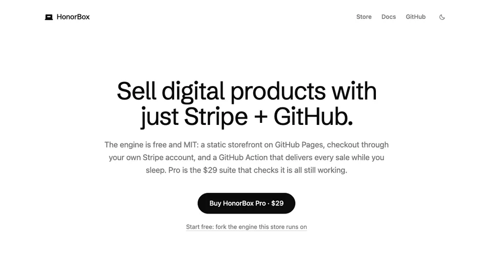
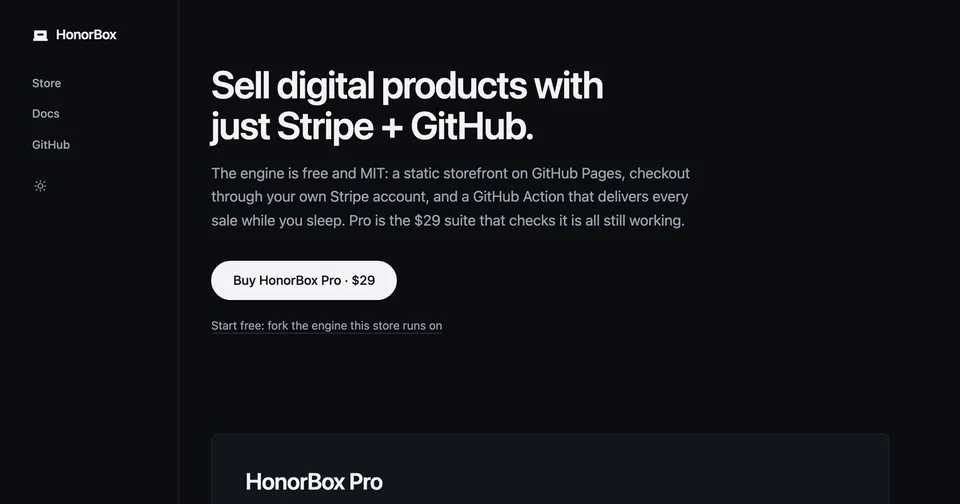

<p align="center">
  <picture>
    <source media="(prefers-color-scheme: dark)" srcset="assets/logo-dark.svg">
    
  </picture>
</p>

**Sell digital products with just Stripe + GitHub. No platform, no monthly fee, no server.**

HonorBox turns a GitHub repo into an unattended store, a roadside honor box
for the internet:

- **Storefront:** a static site built by a zero-dependency Node script and
  hosted free on GitHub Pages. No framework, no build step you have to run, and
  nothing loaded from anyone else's server: zero external scripts, styles,
  fonts or images. The only scripts on a built page are first party and inline,
  about 5 KB unminified and mostly comments: the JSON-LD block search engines
  read, plus a theme toggle and a scroll reveal. Both degrade to a fully
  readable page with JavaScript switched off.
- **Checkout:** Stripe Payment Links on *your own* Stripe account. Buyers pay
  you directly; you pay Stripe's processing rate and nothing on top of it.
- **Fulfillment:** a scheduled GitHub Action polls Stripe, invites each buyer's
  GitHub account to your private product repo, and keeps your books. GitHub
  expires an unaccepted invitation after seven days, so it re-issues before that
  happens: a buyer who missed the email does not quietly lose what they paid
  for. No webhooks required, no database, no server to babysit (opt-in webhook
  mode available when you want near-instant delivery).

**Live demo: [the HonorBox store](https://honorboxx.github.io/honorbox/).** This
repo *is* a working store selling
[HonorBox Pro](https://honorboxx.github.io/honorbox/honorbox-pro.html). The
checkout you see there is the engine in this repo, unmodified.

## Why

| | Gumroad | Lemon Squeezy | Polar ³ | HonorBox |
|---|---|---|---|---|
| Platform fee | 10% + 50¢ ² | 5% + 50¢ | 5% + 50¢ free tier | **0%** |
| Monthly cost | $0 | $0 | $0 on the free tier | **$0** |
| Private-repo delivery | no | no | yes, instant | **yes, usually minutes** |
| Handles VAT for you | yes | yes | yes | no; you're the merchant ¹ |
| Server to maintain | n/a | n/a | n/a | **none** |
| Who holds the money | the platform | the platform | the platform | **you** |

**Read that table honestly.** If you are selling a handful of copies a month,
use a merchant of record. The fee you would save is roughly 81¢ a sale, about
$8 a month at ten sales, and for that they do your VAT; EU digital goods have
no registration threshold for non-EU sellers, so that job starts at your first
sale. HonorBox earns its keep at volume, or when you specifically want the
Stripe account and the customer relationship to be yours.

¹ HonorBox is not a merchant of record. [docs/tax.md](docs/tax.md) spells out
the trade-off.
² Plus card processing (2.9% + 30¢), charged on top per
[Gumroad's fee page](https://gumroad.com/help/article/66-gumroads-fees).
Lemon Squeezy's and Polar's fees include processing; with HonorBox you pay
Stripe's standard rate and nothing else. Fees as published July 2026.
³ [Polar](https://polar.sh) is the closest comparison: private GitHub repo
access is a [built-in benefit](https://polar.sh/docs/features/benefits/github-access)
that grants instantly and revokes on refund, and they are a merchant of record.
If you want that job done for you rather than run by you, use Polar. Fees from
[their docs](https://polar.sh/docs/merchant-of-record/fees), checked
July 20, 2026.

## How it works

```
buyer ──▶ storefront (GitHub Pages, static)
              │  "Buy" = a Stripe Payment Link (custom field: GitHub username)
              ▼
        Stripe Checkout ──▶ money lands in YOUR Stripe balance
              ▲
              │ polled on a schedule (no webhooks/server; opt-in webhook mode = instant)
        GitHub Action ──▶ invites buyer to your private product repo
                     ──▶ appends your (private) sales ledger
```

The fulfillment path is two dependency-free Node files: a 397-line driver on a
473-line pure logic core (which is why it can be unit-tested without a
network). Read both: [`scripts/fulfill.js`](scripts/fulfill.js)
and [`scripts/lib/fulfill-core.js`](scripts/lib/fulfill-core.js).

## Quickstart

1. **Use this template**, edit `store.config.json`: name, copy, your URLs, and
   `repo` (your own `owner/name`). Then delete `products/honorbox-pro.md` and
   `products/crew.md` and write your own: they carry HonorBox's real checkout
   links, and a store that keeps them sells *our* product into *our* Stripe
   account. The build stops you and names every leftover, but it is faster to
   just delete them now.
2. **One command creates your product on Stripe**: Product, Price, and a
   Payment Link with the delivery field, wired straight into your config:

   ```bash
   STRIPE_SECRET_KEY=rk_... node scripts/init.js \
     --name "My Tool" --price 2900 --repo you/my-tool-access
   ```

   (`rk_` = a temporary restricted key; scopes in
   [docs/least-privilege.md](docs/least-privilege.md). Prefer clicking? The
   manual dashboard steps are in [docs/setup.md](docs/setup.md).)
3. **Pages**: copy `setup/workflows/deploy.yml` into `.github/workflows/`, enable
   GitHub Pages (Actions source), push. The store deploys.
4. **Fulfillment**: create a *private* ops repo. Copy in `scripts/` and your
   `store.config.json` (the engine reads its grants from it), and
   [`setup/workflows/fulfill.yml.example`](setup/workflows/fulfill.yml.example)
   renamed to `.github/workflows/fulfill.yml`. Add `STRIPE_SECRET_KEY`
   (restricted key recommended) and a `GH_FULFILL_TOKEN` PAT as secrets.
5. Sell things.

Full walkthrough: [docs/setup.md](docs/setup.md) ·
Architecture and threat model: [docs/how-it-works.md](docs/how-it-works.md)

> **Scared of "secret key in a GitHub Action"? Good instinct.** HonorBox needs
> neither your full Stripe key nor a broad GitHub token: a restricted Stripe key
> with one read-only permission and a fine-grained PAT scoped to the product
> repo alone run the whole engine. Exact toggles, what breaks if you over-cut,
> and what a leaked key could and couldn't do:
> [docs/least-privilege.md](docs/least-privilege.md).

## Optional: a public ledger

The fulfillment engine keeps an anonymized sales ledger (date, product, amount,
country, hash; never names or emails) in your private ops repo. If you *want*
radical transparency, drop that `ledger/ledger.json` into your storefront repo
and the builder adds a public `/trust` page for it. Off by default.

## The themes

The free core ships `stand` (monochrome and centred, the theme this repo's own
store runs on) **and `terminal`** (phosphor on glass, for CLI tools). Both carry
a light and a dark palette built as mirrors, and a toggle that remembers the
reader's choice. Pro adds `rail`, a fixed left navigation column, switchable
with one config line:

| | | |
|---|---|---|
|  |  |  |

## Free core vs Pro

The free core is a **complete store**: two themes, checkout, fulfillment, docs.

When a new store makes no sales, *"nobody came"* and *"my store is silently
broken"* look exactly the same from where you are standing. Both are a quiet
dashboard and an empty ledger.
[HonorBox Pro](https://honorboxx.github.io/honorbox/honorbox-pro.html) is mostly
one answer to that: a **conformance suite** that checks your store against the
known ways this architecture loses money quietly, on every push, and fails the
build when it finds one. Most of its checks fire with zero orders in your
account, which is when you need them. A deactivated payment link still answers
its URL with HTTP 200 and the ordinary checkout page, so a link checker, an
uptime monitor and a `curl` in CI all report your dead buy button as healthy;
the suite asks the API instead. The
[failure catalogue behind it](docs/failure-catalogue.md) is published here in
full, free, and is worth reading even if you never buy anything.

Pro also adds a store doctor, reconcile (which pairs every paid order back to
whether that buyer has access *right now*), a refund guard and support bot,
tracker-free stats, the `rail` theme, an offline ed25519 license-key module, and
a commerce playbook. One-time: **$29** for one developer, **$99** for a team of
up to five, **$249** for a company. Buying it funds the free core.

## Stability promise

`store.config.json`, the product frontmatter, and the fulfillment grant format
are **stable**: breaking changes only in a major version, always with an
UPGRADING note and a migration path. The internals move fast; the format holds
still.

## Development

```
npm test                                # the whole suite (what CI runs)
node --test scripts/test/core.test.js   # one file, while iterating
node scripts/build.js                   # build storefront -> dist/
```

No dependencies. Node ≥ 20.

## Support

honorbox@proton.me · [issues](https://github.com/Honorboxx/honorbox/issues)

## License

MIT for everything in this repo. Pro content is licensed separately.
